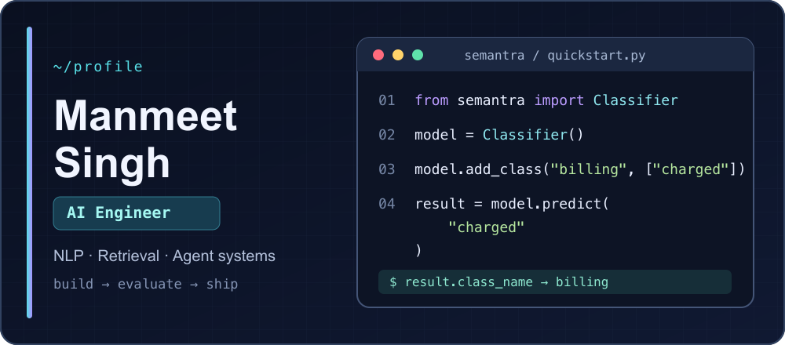
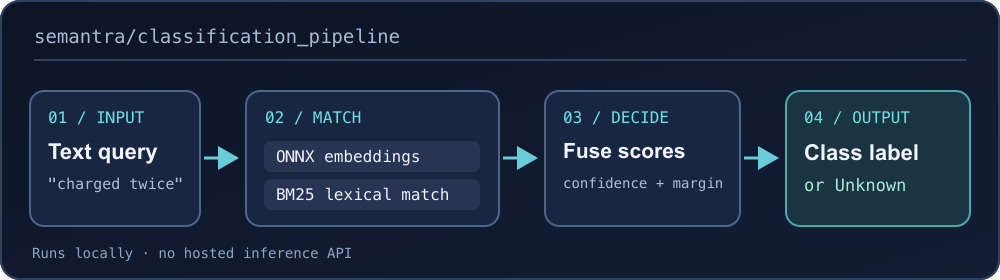

<div align="center">

# Manmeet Singh · AI Engineer

I build practical NLP tools, retrieval systems, and agent workflows that developers can run, evaluate, and ship.

[Portfolio](https://manmeet75.github.io/Portfolio/) · [LinkedIn](https://www.linkedin.com/in/manmeet75/) · [Repositories](https://github.com/MANMEET75?tab=repositories)

</div>

## `> featured_build`

### [Semantra](https://github.com/MANMEET75/semantra-classify) — local-first text classification

Few-shot classification with ONNX embeddings, BM25 matching, and confidence checks. It runs locally without a hosted inference API and can return `Unknown` for ambiguous input. [Install from PyPI →](https://pypi.org/project/semantra-classify/)



<details>
<summary><strong>Run the code</strong></summary>

```bash
pip install semantra-classify
```

```python
from semantra import Classifier

classifier = Classifier()
classifier.add_class("billing", ["I was charged twice", "My invoice is wrong"])
classifier.add_class("support", ["The app will not open", "I need technical help"])

result = classifier.predict("There is an extra charge on my invoice")
print(result.class_name, result.confidence)
```

[Full quick start →](https://github.com/MANMEET75/semantra-classify#quick-start)

</details>

## `> more_projects`

| Project | What I built | Stack |
| --- | --- | --- |
| [Document Summarizer](https://github.com/MANMEET75/DocumentSummarizer-AgenticRAG-LlamaIndex) | Document summarization and retrieval with an API | Python · LlamaIndex · FastAPI |
| [MCP Agentic Data Engineering](https://github.com/MANMEET75/MCP-Agentic-Data-Engineering) | Tool-driven data ingestion and workflow experiments | Python · MCP · MongoDB · MySQL |
| [DataMentor](https://github.com/MANMEET75/DataMentor) | Data science interview assistant using a fine-tuned Mistral model | Python · Mistral · QLoRA |

<details>
<summary><strong>Explore more repositories</strong></summary>

- [VideoAnalytics-HAR](https://github.com/MANMEET75/VideoAnalytics-HAR) — human activity recognition.
- [HindBot](https://github.com/MANMEET75/HindBot) — retrieval-based question answering over documents.
- [Portfolio](https://github.com/MANMEET75/Portfolio) — personal website source.
- [Browse all repositories →](https://github.com/MANMEET75?tab=repositories)

</details>

## `> toolbox`

`Python` · `SQL` · `NLP` · `embeddings` · `RAG` · `ONNX Runtime` · `FastAPI` · `Docker` · `GitHub Actions` · `AWS`

**Building something in applied AI?** [Connect on LinkedIn](https://www.linkedin.com/in/manmeet75/).
